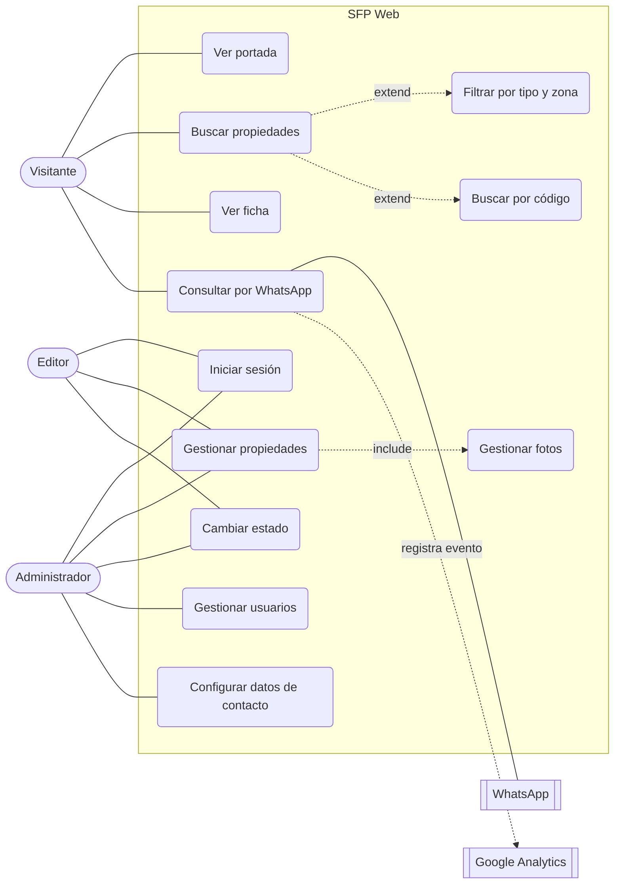
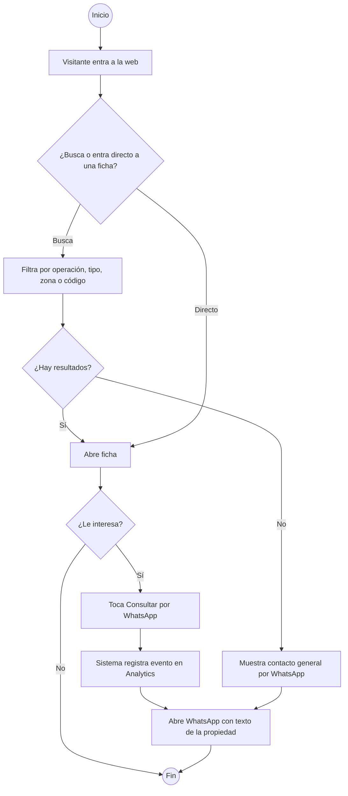
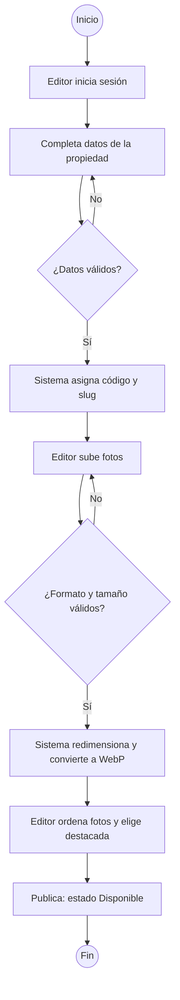
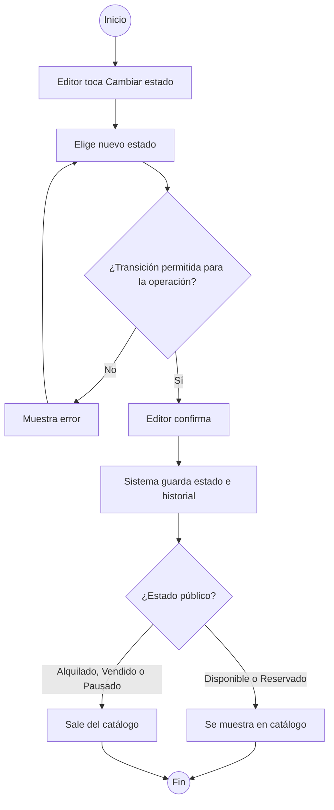
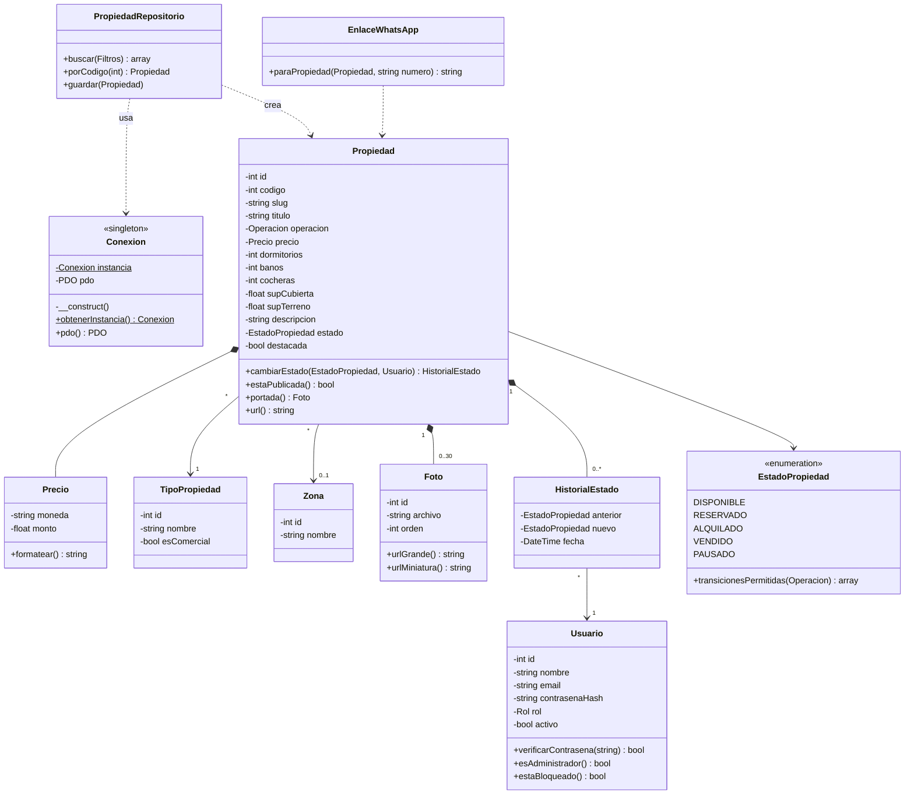

# Santa Fe Propiedades — Web Etapa 1

Análisis y diseño del sitio, siguiendo el método del trabajo práctico del Grupo 6 (Metodología en Sistemas I y II; referencia en `G:\Proyectos\SVAS\docs\MODELO.md`). Cada sección corresponde a una entrega de ese TP.

- **Cliente:** Santa Fe Propiedades (CCI Mat. 099), 4 de Enero 2328, Santa Fe.
- **Desarrollo:** Tars automatizaciones.
- **Propuesta:** [`propuesta-etapa1.pdf`](propuesta-etapa1.pdf). Etapa 1 de 3, entre 10 y 12 días hábiles. Total del proyecto: 500 USD (Etapa 1: 200 USD). Hosting: 100 USD por 24 meses.
- **Web actual (a reemplazar):** https://santafe-propiedades.com.ar, desarrollada por Grupo Guadalupe S.R.L. Tiene un mantenimiento de $40.000 por mes.
- **Stack elegido:** PHP 8 + MySQL, sin framework, para hosting compartido (Hostinger o DonWeb).

---

## 1. Introducción general

### Organización
Santa Fe Propiedades nace en 2007, respaldada por un grupo con más de 30 años en la construcción. Trabaja en Santa Fe Capital y alrededores (Sauce Viejo, Recreo, Colastiné).

Servicios que publica hoy:
1. **Tasaciones.**
2. **Administración de alquileres.**
3. **Asesoramiento en compraventa de inmuebles.**
4. **Publicidad / difusión comercial:** web, cartelería, redes y medios.
5. **Asesoramiento y ejecución de obras:** staff de profesionales matriculados en construcción.

Contacto: santafepropiedades@hotmail.com · 0342 4-559-864 · 0342 4-219298 (WhatsApp) · Instagram @santafepropiedadesinmobiliaria. Matrículas CCI 099 y CCI 731. Horario: lunes a viernes de 8 a 12 y de 16 a 19 hs.

### Situación actual y problemática
- **La inmobiliaria no es titular de su web.** La desarrolla y mantiene un tercero que cobra $40.000 por mes. No tiene acceso a estadísticas ni al hosting.
- **No hay datos de audiencia.** No se sabe de dónde vienen las visitas ni qué propiedades generan interés.
- **Las consultas llegan por formulario de email.** El canal real de la inmobiliaria es WhatsApp.
- **Problemas visibles en la web actual:**
  - el mapa de Google no carga en las fichas (error de la API);
  - el pie tiene texto de plantilla en inglés sin traducir ("Login", "New User Sign Up", "Join today…");
  - hay errores de tipeo ("INMUBLES", "tasaciónes");
  - la sección "Fideicomiso" está vacía;
  - las URL no son amigables (`descripcion.php?id=258`).
- **Inventario:** 25 propiedades activas en la web al 30/09/2026. El Excel del bot de WhatsApp tiene 23 y no coincide: le faltan las propiedades 177, 249 y 258, y tiene la 116, que ya no está publicada.
- **Datos de propiedades con errores:** el galpón 208 (alquiler) muestra un precio de "$ 0", y la 239 tiene una sola foto.

### Instagram: la fuente más actualizada
Cuenta [@santafepropiedadesinmobiliaria](https://www.instagram.com/santafepropiedadesinmobiliaria/): 2251 seguidores y publicaciones cada 2 a 5 días. Se relevaron los 12 posts más recientes (19/08 al 27/09/2026); sin iniciar sesión Instagram no muestra más.

**Datos de la bio que la web no tiene:**
- Matrículas **CCI 099 y CCI 731** (la web solo muestra la 099).
- Horario: **lunes a viernes de 8 a 12 y de 16 a 19 hs**.
- WhatsApp `wa.me/5493424219298` (confirma el número de la web).
- Historias destacadas: Alquileres, Ventas, Contacto, Tasaciones.

**Instagram ya manda tráfico a la web.** Las placas cierran con "Más info y fotos en **santafepropiedades.com.ar**", que es el dominio sin guion. Hoy ese dominio apunta al mismo servidor que la web vieja (192.99.168.30).

**Diferencias de estado entre Instagram y la web**, ordenadas por urgencia:

| Propiedad | Web actual | Instagram | Qué hacer al migrar |
|---|---|---|---|
| 172 · Dpto 2 dorm., 25 de Mayo 1641 | Publicada, precio a consultar | **VENDIDA** (27/09), USD 82.000, 75 m² | Cargar como Vendido |
| 247 · Semipiso amoblado, 4 de Enero 3041 | Publicada, $950.000 | **NO DISPONIBLE** (01/09) | Cargar como Alquilado |
| 116 · Dpto c/cochera, D. Silva 1350 | No publicada (sí está en el Excel del bot) | **RESERVADO** (28/08), $680.000 | Confirmar si se alquiló |
| 252 · Dpto a estrenar, S. Caputto 3155 | $700.000; el título dice "z/ Constituyentes" | $700.000 (bajó de $750.000); zona "Centro Sur" | Confirmar la zona |
| 257 · Dpto 1 dorm., Crespo 3200 | $650.000 | $650.000, 52 m², requisito: 5 recibos de sueldo | Completar m² y requisitos |
| 238 · Dpto 2 dorm. + cochera, Jujuy 2969 | Valor a consultar | 2.º piso al frente, orientación norte, suite, 2 baños | Completar descripción |
| 254 · Casa a restaurar, Dr. Zavalla 1800 | U$S 40.000 | Lote de 250 m², 84 m² cubiertos | Completar superficies |
| 78 · Lote en Colastiné | Precio a consultar | Aldea Setúbal (U11), 22 × 34 m, detrás de UPCN, luz | Completar medidas y referencias |
| 258, 126, 32 | Iguales | Iguales | Sin cambios |

**Conclusión:** para la migración, la web aporta las fotos y la estructura, e Instagram aporta el estado, el precio y la descripción más recientes. Si no coinciden, gana Instagram.

### Objetivo
Una web rápida, adaptada a celulares, conectada directo con WhatsApp y bajo titularidad total de la inmobiliaria. El equipo tiene que poder autogestionar el catálogo sin intermediarios.

---

## 2. Dominio del sistema

**Sitio web institucional con catálogo autogestionable de Santa Fe Propiedades (SFP Web).**

---

## 3. Descripción del dominio

### Descripción genérica
Un visitante entra a la web desde Google, Instagram o un enlace compartido por WhatsApp. Ve la portada con las propiedades destacadas, los servicios y los datos de contacto. Busca en el catálogo por operación, tipo, zona o código, y abre la ficha de una propiedad: fotos, precio, características y ubicación. Si le interesa, toca "Consultar por WhatsApp" y se abre una conversación con la inmobiliaria con un texto que ya identifica la propiedad.

El equipo de la inmobiliaria entra a un panel privado. Carga propiedades nuevas con sus fotos, modifica valores y, cuando una propiedad se alquila o se vende, cambia su estado en dos pasos. La propiedad sale del catálogo público y el cambio queda registrado.

Toda la actividad de los visitantes se mide con Google Analytics, y la presencia en Google con Search Console, ambos a nombre de la inmobiliaria.

### Descripción detallada

**Visitante: consulta de una propiedad**
1. Entra a la portada o directo a una ficha.
2. Filtra el catálogo (venta, alquiler o comerciales; tipo; zona) o busca por código.
3. Abre la ficha y navega las fotos.
4. Toca "Consultar por WhatsApp".
5. El sitio registra el evento en Analytics (código, operación y tipo).
6. Se abre WhatsApp con el texto: *"Hola, me interesa la propiedad #258 — Local sobre Av. Galicia (enlace)"*.

**Equipo: alta de propiedad**
1. Inicia sesión en el panel.
2. Completa la ficha: operación, tipo, zona, dirección, precio, datos técnicos y descripción.
3. Sube las fotos. El sistema las redimensiona y las convierte a WebP.
4. Ordena las fotos; la primera es la portada.
5. Marca la propiedad como destacada (opcional) y publica.

**Equipo: cambio de estado**
1. En el listado del panel toca "Cambiar estado" en la propiedad (paso 1).
2. Elige el nuevo estado (Reservado, Alquilado, Vendido, Pausado o Disponible) y confirma (paso 2).
3. El sistema valida que el cambio sea permitido, lo guarda en el historial y actualiza el catálogo.

---

## 4. Requerimientos

### Requerimientos funcionales

**Sitio público**
- Portada: propiedades destacadas, bloque de servicios, presentación de la empresa y contacto con la oficina.
- Catálogo: listados de Ventas, Alquileres y Comerciales; filtro por tipo y zona; búsqueda por código.
- Ficha de propiedad: galería de fotos, precio o "Consultar precio", datos técnicos, descripción, ubicación y botón de WhatsApp con texto preconfigurado.
- Páginas de Empresa, Servicios y Contacto (en Etapa 1 son secciones de la portada).
- Redirección de las URL viejas (`descripcion.php?id=N`) a las nuevas, para no perder enlaces compartidos ni posicionamiento.

**Panel de autogestión**
- Login y logout, con bloqueo temporal después de varios intentos fallidos.
- Propiedades: alta, modificación, baja lógica, destacada.
- Fotos: subir, ordenar y eliminar.
- Cambio de estado en dos pasos, con historial.
- Botón **"Copiar texto para Instagram"** en cada ficha: arma la publicación con el formato que ya usa la cuenta (sección 16), con el enlace y los hashtags. El equipo carga la propiedad una sola vez y la publica en los dos lados.
- Usuarios y configuración (solo el Administrador): número de WhatsApp, teléfonos, email, horario, textos de servicios.

**Analítica**
- Google Analytics 4 con eventos: `consulta_whatsapp`, `click_telefono`, vista de ficha.
- Google Search Console con `sitemap.xml` dinámico.

### Requerimientos no funcionales
- **Diseño adaptable:** celular primero.
- **Rendimiento:** Lighthouse en celular de 90 o más. Imágenes WebP con carga diferida y sin frameworks pesados.
- **Hosting compartido:** PHP 8.2+, MySQL 8 o MariaDB 10.6+, SSL gratuito. Sin Composer ni compilación en el servidor.
- **Seguridad:** contraseñas con `password_hash`, consultas preparadas (PDO), token CSRF en formularios del panel, validación de archivos subidos, cabeceras de seguridad y HTTPS obligatorio.
- **Titularidad:** hosting, dominio, Analytics y Search Console a nombre de Santa Fe Propiedades.
- **Enlaces compartidos:** etiquetas Open Graph para que al compartir una ficha por WhatsApp se vea la foto, el título y el precio.

### Actores

| Actor | Rol |
|---|---|
| Visitante | Interesado que busca propiedades y consulta |
| Editor | Integrante del equipo: gestiona propiedades, fotos y estados |
| Administrador | Dueño o Tars: todo lo del Editor más usuarios y configuración |
| WhatsApp | Sistema externo: recibe la consulta |
| Google Analytics / Search Console | Sistemas externos: miden la audiencia y la presencia en Google |

---

## 5. Historias de usuario (backlog)

Agrupadas por función, siguiendo la observación del TP3 ("no micro historias"). Cada una se divide en tareas.

| # | Historia | Tareas principales | Cronograma |
|---|---|---|---|
| HU1 | Como visitante quiero ver una portada clara con destacadas, servicios y contacto | Maquetación base, bloque de servicios, contacto y oficina | Días 1–3 |
| HU2 | Como visitante quiero buscar propiedades por operación, tipo, zona o código | Listados, filtros y paginación | Días 4–7 |
| HU3 | Como visitante quiero ver la ficha completa y consultar por WhatsApp en un toque | Ficha, galería, enlace dinámico `wa.me`, Open Graph | Días 4–7 |
| HU4 | Como inmobiliaria quiero todo mi catálogo actual en la web nueva | Script de migración (25 fichas + fotos), redirecciones 301 | Días 4–7 |
| HU5 | Como editor quiero entrar a un panel privado | Login, logout, bloqueo por intentos, sesión segura | Días 8–10 |
| HU6 | Como editor quiero cargar y modificar propiedades con fotos | ABM de propiedad, subida y orden de fotos, destacada | Días 8–10 |
| HU7 | Como editor quiero marcar una propiedad como Alquilada o Vendida en dos pasos | Cambio de estado con confirmación e historial | Días 8–10 |
| HU8 | Como dueño quiero saber quién visita la web y qué propiedades interesan | GA4 con eventos, Search Console, sitemap | Días 8–10 |
| HU9 | Como administrador quiero gestionar usuarios y datos de contacto | ABM de usuarios y configuración | Días 8–10 |
| HU10 | Como inmobiliaria quiero la web publicada en mi dominio | Servidor, dominio, SSL (días 1–3); pruebas en celulares, publicación e instructivo (días 11–12) | Días 1–3 y 11–12 |

---

## 6. Reglas de negocio

| Regla | Enunciado |
|---|---|
| a | Una propiedad tiene una sola operación: venta o alquiler. Si se ofrece en ambas, se cargan dos fichas. |
| b | Una propiedad pertenece a un solo tipo y, opcionalmente, a una zona. Algunos tipos son comerciales (salón/local, galpón, cochera) y forman el listado "Comerciales". |
| c | El precio es opcional. Si no hay precio se muestra "Consultar precio". Si hay precio, la moneda (ARS o USD) es obligatoria. |
| d | Estados posibles: Disponible, Reservado, Alquilado, Vendido y Pausado. Solo las propiedades Disponibles y Reservadas aparecen en el catálogo público; las Reservadas muestran una etiqueta. |
| e | "Alquilado" solo vale para operaciones de alquiler y "Vendido" solo para ventas. Una propiedad alquilada puede volver a Disponible. Una vendida es estado final: solo el Administrador puede revertirla. |
| f | Todo cambio de estado se confirma en dos pasos y queda en el historial con el usuario, la fecha, el estado anterior y el nuevo. |
| g | Cada propiedad tiene de 0 a 30 fotos, ordenadas. La primera es la portada. Solo se aceptan JPG, PNG o WebP de hasta 8 MB; se guardan en WebP a 1600 px y con miniatura de 480 px. |
| h | Cada propiedad tiene un código público único. Las propiedades migradas conservan su número actual (por ejemplo, 258) para que funcione "Buscar por código" y las redirecciones. Las nuevas continúan la numeración. |
| i | El botón de WhatsApp abre `wa.me/<número configurado>` con el código, el título y el enlace de la propiedad. |
| j | Cada consulta por WhatsApp se registra en Analytics como evento `consulta_whatsapp`, con el código de la propiedad. |
| k | Las propiedades no se borran físicamente. La baja es lógica, para no perder historial ni enlaces. |
| l | Solo los usuarios autenticados entran al panel. Cada usuario tiene un solo rol: Administrador o Editor. |
| m | Después de 5 intentos de login fallidos, la cuenta se bloquea 15 minutos. |
| n | Hosting, dominio, Analytics y Search Console quedan a nombre de Santa Fe Propiedades. |

---

## 7. Clases conceptuales

Usuario, Administrador, Editor, Propiedad, TipoPropiedad, Zona, Foto, EstadoPropiedad, HistorialEstado, Servicio (servicio de la inmobiliaria), Configuración, Consulta (a futuro: Etapa 2).

---

## 8. Casos de uso



---

## 9. Diagramas de actividad

### Consulta por WhatsApp


### Alta de propiedad


### Cambio de estado en dos pasos


---

## 10. Diagrama de clases



---

## 11. Modelo de datos (MySQL)

Esquema completo en [`../database/schema.sql`](../database/schema.sql).

| Tabla | Para qué |
|---|---|
| `usuario` | Acceso al panel, rol, bloqueo por intentos fallidos |
| `tipo_propiedad` | Casa, casa quinta, cochera, departamento, galpón, lote/terreno, salón/local, fideicomiso; marca `es_comercial` |
| `zona` | Barrios y localidades, con coordenadas para el mapa de la Etapa 2 |
| `propiedad` | Ficha completa, estado, destacada, coordenadas, baja lógica. Por Instagram se agregaron: requisitos, disponible desde, amoblado, ubicación en el edificio (frente o contrafrente), detalle de expensas ("bajas", "sin expensas"), frente y fondo del lote, referencias cercanas y enlace al post o reel |
| `foto` | Fotos por propiedad, ordenadas (la primera es la portada) |
| `historial_estado` | Quién cambió el estado, cuándo y de qué a qué |
| `servicio` | Bloque de servicios editable desde el panel |
| `configuracion` | WhatsApp, teléfonos, email, dirección, matrícula, ID de Analytics |

**Tablas previstas para las próximas etapas:**
- Etapa 2: `consulta` (interesados capturados por el asistente 24/7 y el botón "¿No encontraste lo que buscabas?") y `punto_interes` (facultades, puerto, costanera, terminal).
- Etapa 3: `faq` y `pagina`.

---

## 12. Patrón de diseño: Singleton

Se aplica en la clase `Conexion`, que entrega la conexión PDO a MySQL. El hosting compartido limita las conexiones simultáneas por usuario de base de datos (`max_user_connections`, en general entre 15 y 30). Si cada repositorio abriera su propia conexión, una página con varios bloques (destacadas, servicios, configuración) abriría varias conexiones por visita, y con tráfico se llegaría al límite ("Too many connections"). Con el Singleton hay **una sola conexión por solicitud**, compartida por todo el sistema.

A diferencia del numerador del TP (que en una web necesita persistirse en la base), acá el Singleton en memoria es correcto: PHP crea un proceso nuevo por solicitud y la conexión solo tiene que ser única dentro de esa solicitud.

### Pruebas planificadas (PHPUnit)

**Unitarias**
- `Conexion::obtenerInstancia()` devuelve siempre el mismo objeto.
- `Precio::formatear()`: `U$S 159.000`, `$ 700.000` y "Consultar precio" cuando no hay monto.
- `EstadoPropiedad`: Vendido no se permite en alquileres, Alquilado no se permite en ventas, y un Editor no puede revertir Vendido.
- `EnlaceWhatsApp`: número en formato internacional `549342…` y texto codificado para URL.
- Generación de slug: acentos, eñes y espacios.

**Funcionales**
- Una propiedad cargada con fotos aparece en el catálogo con su portada.
- Al marcarla como Vendida desaparece del catálogo y queda un registro en el historial.
- Los filtros por operación, tipo y zona devuelven los resultados correctos.
- Después de 5 intentos de login fallidos, la cuenta se bloquea.
- `descripcion.php?id=258` redirige con 301 a `/propiedad/258-local-sobre-av-galicia`.

---

## 13. Arquitectura técnica

```
SantaFePropiedades-Web/
├── public/                  → se sube a public_html
│   ├── index.php            controlador frontal
│   ├── .htaccess            URL amigables, HTTPS, caché, cabeceras de seguridad
│   ├── assets/              css, js, img
│   └── uploads/propiedades/ fotos WebP por código
├── app/                     → fuera de public_html si el hosting lo permite
│   ├── Core/                Conexion (Singleton), Router, Vista, Sesion, Csrf
│   ├── Modelos/             Propiedad, Foto, Usuario, Precio, EstadoPropiedad
│   ├── Repositorios/
│   ├── Servicios/           ImagenServicio (GD → WebP), EnlaceWhatsApp
│   ├── Controladores/       Publico/, Panel/
│   └── Vistas/              publico/, panel/, layouts/
├── config/                  config.php (credenciales, fuera del repositorio)
├── database/                schema.sql, seeds.sql
├── scripts/                 migrar_catalogo.php
├── tests/
└── docs/
```

- **Sin dependencias en producción:** PHP puro, HTML, CSS y JavaScript sin compilar. Se sube por FTP o con el administrador de archivos.
- **Imágenes:** se procesan con GD, que viene en el hosting compartido, a WebP de 1600 px más una miniatura de 480 px.
- **Analytics:** GA4 con `gtag.js`; los eventos se envían desde el botón de WhatsApp y los teléfonos.
- **SEO base de la Etapa 1:** título y descripción por ficha, Open Graph, `sitemap.xml`, `robots.txt` y datos estructurados `RealEstateAgent`. El SEO local completo queda para la Etapa 3. Las palabras clave salen de los hashtags que ya usa la cuenta: alquiler Santa Fe, departamento en venta, Santa Fe Capital y los nombres de barrios.
- **Tráfico desde Instagram medible:** el enlace de la bio y los de las historias llevan parámetros UTM (`?utm_source=instagram&utm_medium=bio`, y `utm_campaign=<código>` por propiedad). Así Analytics separa las visitas que vienen de Instagram, como pide la propuesta ("fuentes de tráfico").
- **Integración futura con el bot:** el asistente 24/7 de la Etapa 2 puede reutilizar el bot de WhatsApp existente (`G:\BotInmobiliaria`), leyendo el inventario desde esta base en lugar del Excel. Así hay una sola fuente de datos.

---

## 14. Migración del catálogo

Hay dos fuentes: **la web actual** aporta las fotos y la estructura, e **Instagram** aporta el estado, el precio y las descripciones más recientes (ver la tabla de la sección 1). El Excel del bot no se usa porque está desactualizado.

1. Recorrer el listado completo (25 propiedades en 3 páginas).
2. De cada `descripcion.php?id=N` extraer: título, operación y tipo (del breadcrumb), descripción, régimen, planta, características, servicios, precio y moneda, dirección, zona y fotos (`/cache/…`).
3. Sacar dormitorios, baños y cocheras del texto de características ("2 Dormitorio/s - 1 Baño/s…").
4. Descargar las fotos, convertirlas a WebP e insertarlas con el mismo código.
5. Aplicar las correcciones de Instagram: la 172 como Vendido, la 247 como Alquilado, y completar superficies, requisitos y descripciones. El precio "$ 0" del galpón 208 pasa a "Consultar precio".
6. Revisar el resultado con el cliente: precios faltantes, zonas vacías y textos con errores.

---

## 15. Pendientes con el cliente

1. **Dominio.** Los dos dominios existen y apuntan al mismo servidor de la web vieja (192.99.168.30): `santafepropiedades.com.ar`, que es el que difunde Instagram, y `santafe-propiedades.com.ar`. Hay que saber **quién figura como titular en NIC.ar** y quién maneja los DNS. Si el titular es Grupo Guadalupe, primero hay que transferir los dominios a la inmobiliaria. Plan: la web nueva en `santafepropiedades.com.ar` y el dominio con guion redirigido con 301.
2. **Hosting:** Hostinger o DonWeb, con plan de PHP 8.2+, MySQL, SSL gratis y, si es posible, SSH.
3. **Cuenta de Google de la inmobiliaria** para Analytics y Search Console.
4. **WhatsApp:** confirmar que el número de consultas es 0342 4-219298.
5. **Logo en alta calidad** (vector o PNG grande).
6. **Vendidas y alquiladas:** en Instagram las publican con "❌VENDIDA❌" o "❌NO DISPONIBLE❌", o sea que les sirve mostrar trayectoria. Propuesta: en la web se muestran con esa etiqueta durante 30 días y después salen del catálogo. Hay que confirmarlo.
7. **Servicios:** la web actual tiene 5 (incluye "Asesoramiento y ejecución de obras"); la propuesta menciona 4. ¿Se mantiene "Obras"?
8. **Fideicomiso:** el tipo existe en la web actual pero está vacío. ¿Se mantiene?
9. **Usuarios del panel:** cuántos son y qué emails usan.
10. **Precios:** 13 de las 23 propiedades del Excel no tienen precio. ¿Siguen como "Consultar precio"?
11. **Filtros:** la propuesta deja los filtros dinámicos para la Etapa 2, pero la web actual ya tiene un buscador por tipo, zona, operación y código. La Etapa 1 mantiene ese buscador básico para no perder funciones; los filtros por dormitorios y el botón de rescate quedan para la Etapa 2.
12. **Estados según Instagram:** confirmar que la 172 se vendió, que la 247 se alquiló y qué pasó con la 116 (reservada el 28/08). Confirmar también la zona de la 252: Centro Sur o Constituyentes.
13. **Material de marca:** las placas las diseña un compañero de trabajo de Tars. La tipografía de marca ya está definida: **Open Sauce** (ver sección 16). Falta pedirle el logo en alta calidad y los archivos fuente de la plantilla.

---

## 16. Contenido e identidad visual (tomado de Instagram)

### Formato de ficha
Las publicaciones siguen una estructura fija que el público ya reconoce. La ficha web y el texto generado para Instagram la respetan:

```
OPERACIÓN | TIPO + RASGO PRINCIPAL          → ALQUILER | DPTO 1 HAB AL FRENTE
📍 Zona o dirección                          → 📍 CRESPO 3200
Párrafo corto con ubicación y referencias    → "…muy cerca de Bv. Gálvez y la Costanera"
Lista de características, una por línea:
  🛏️ dormitorios · 🚿 baños · 🛋️ living · 🍳 cocina · 🧺 lavadero · 🌅 balcón · 🚗 cochera · 🏢 ascensor
📝 Requisitos (alquiler)                     → 5 recibos de sueldo
💵 Precio | expensas                         → $650.000/mes | Bajas expensas
📲 Llamado a WhatsApp
#hashtags
```

En la web, los emojis se reemplazan por íconos SVG y la lista de características se muestra como grilla. El orden de la información es el mismo.

### Identidad visual
- **Logo:** "SANTA FE / PROPIEDADES" en gris oscuro, con cuadrados **rojos** arriba y **azules** abajo.
- **Placas:** foto a sangre con degradé oscuro abajo; título en mayúsculas, fuerte y condensado; rasgos separados por "|"; pin rojo antes de la dirección; etiqueta superior "Alquileres ——— logo".
- **Código de color:** **azul = alquiler** y **rojo = venta**. La web usa las mismas etiquetas de color en tarjetas y fichas, así se reconoce la marca de Instagram a primera vista.
- **Acento celeste** para llamados a la acción ("MÁS INFO Y FOTOS").
- **Tipografía:** **Open Sauce Sans** en toda la web y en el panel (definida por Tars el 30/09/2026). Tiene licencia libre OFL 1.1 y no está en Google Fonts, así que se sirve desde jsDelivr (paquete de Fontsource fijado en la versión 5.3.0). Usa los pesos 400, 600, 700, 800 y 900; los títulos van en mayúsculas con peso 900.
